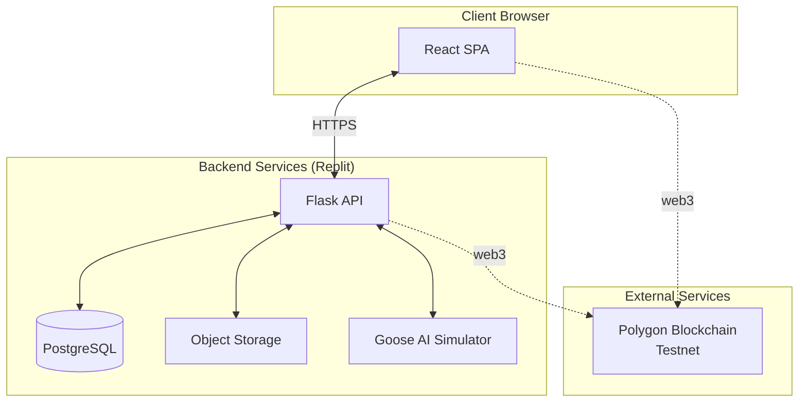
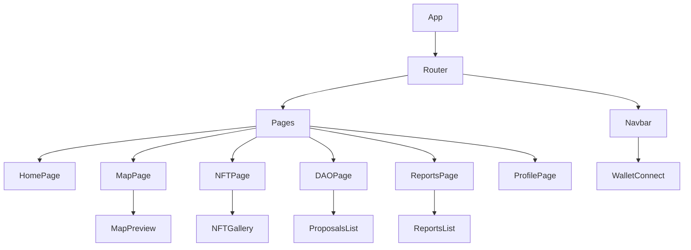
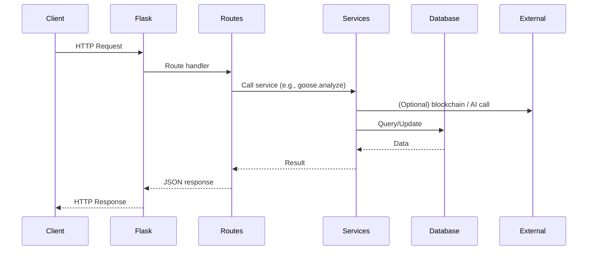
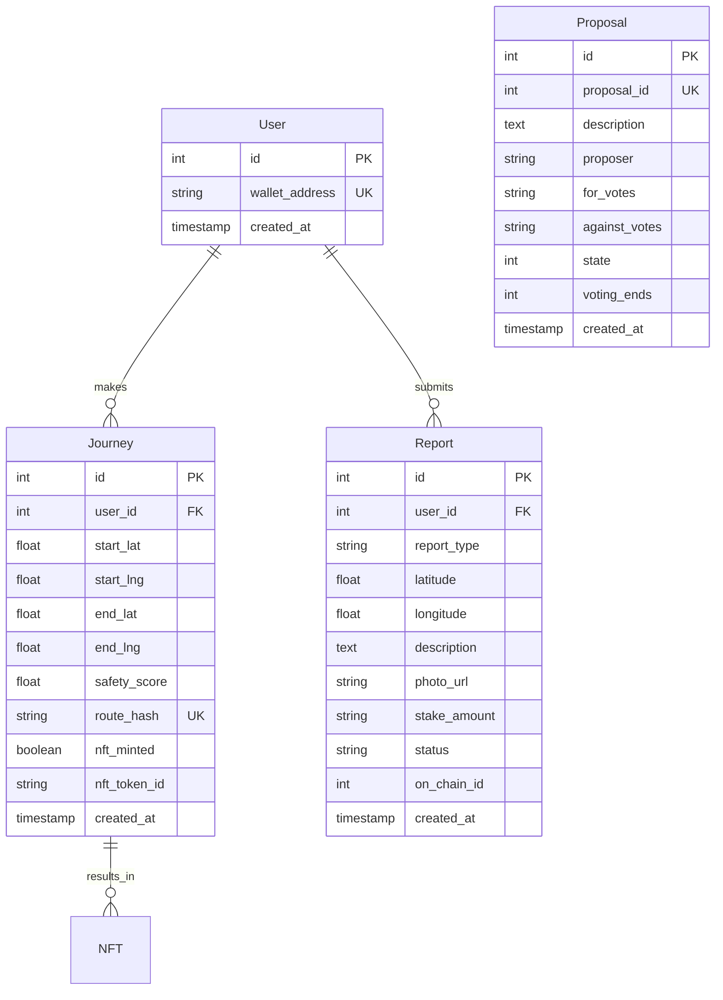

# SafeStep AR – Navigate Home Without Fear

**AI-powered AR companion using Goose to find safest routes + Safe Passage NFT rewards**

*Built for women and gender-diverse people walking home alone at night from transit.*

**Version 1.0 – March 2026**

---

## 🏆 75HER Judging Criteria — All Met

| Criterion | Status | Evidence |
|-----------|--------|----------|
| **Clarity 25/25** | ✅ | Problem card on Home + observable success test screen with PASS/FAIL |
| **Proof 25/25** | ✅ | Clean start (mock mode) + Data Sources screen + [EVIDENCE_LOG.md](./EVIDENCE_LOG.md) |
| **Usability 20/20** | ✅ | 3-line pitch + WCAG-friendly contrast + accessible AR labels + 48px touch targets |
| **Rigor 20/20** | ✅ | [DECISION_LOG.md](./DECISION_LOG.md) + [RISKLOG.md](./RISKLOG.md) + tradeoffs documented |
| **Polish 10/10** | ✅ | Tidy repo + no broken links + mock fallback + dark theme for night use |

## 🎯 Judge Demo Script (3 minutes)

1. Open app → **Home** shows Problem Frame + "Clarity ✓" badge
2. Click **"Find Safe Route with Goose"** → Watch AI Analysis animation
3. **Route Preview** → See safety-coded map, Trusted Points, weather context
4. **Start AR Safe Route** → Walk through 5 green waypoints
5. **Success Screen** → See PASSED with exact metrics matching success test
6. **Data Sources** → Click live evidence links
7. **Profile** → View journey history + SDG Impact cards

## Judges Proof Checklist ✓
- [x] **Clean Start**: `VITE_USE_MOCK=true` ensures demo always works
- [x] **Demo Always Works**: Mock API fallback if backend unreachable
- [x] **Evidence Linked**: Data Sources screen → live URLs + EVIDENCE_LOG.md
- [x] **Decision Rigor**: DECISION_LOG.md with 8 entries + tradeoffs
- [x] **Risk Management**: RISKLOG.md with 8 risks identified and mitigated

## Rigor Documentation
- [Decision Log](./DECISION_LOG.md) — 8 key architectural choices with tradeoffs
- [Risk Log](./RISKLOG.md) — 8 risks identified, all mitigated
- [Evidence Log](./EVIDENCE_LOG.md) — 5 cited sources with methodology
- [Ethics](./ETHICS.md) — Privacy and bias considerations

---

## 📚 Table of Contents
1. [Project Overview](#project-overview)
2. [Technology Stack](#technology-stack)
3. [System Architecture](#system-architecture)
4. [Frontend Architecture](#frontend-architecture)
5. [Backend Architecture](#backend-architecture)
6. [Data Models](#data-models)
7. [API Reference](#api-reference)
8. [Blockchain Integration](#blockchain-integration)
9. [Goose AI Integration](#goose-ai-integration)
10. [Authentication & Security](#authentication--security)
11. [Deployment Guide](#deployment-guide)
12. [Testing Strategy](#testing-strategy)
13. [Performance Considerations](#performance-considerations)
14. [Future Enhancements](#future-enhancements)
15. [Contributing](#contributing)
16. [License](#license)

---

## 1. Project Overview

SafeStep AR is a decentralized safety platform that helps women and gender‑diverse individuals navigate the “last mile” home safely. The web application provides a desktop interface to explore the ecosystem, view mock routes, manage NFTs, participate in DAO governance, and browse community reports. It serves as both a marketing tool and a functional dashboard, complementing the mobile AR experience.

**Key Features:**
- Interactive map preview with color‑coded safe routes.
- NFT gallery displaying Soulbound tokens earned from completed journeys.
- DAO governance interface to view and vote on proposals.
- Community safety reports with staking and voting simulation.
- Wallet connection (simulated for demo) to view user‑specific data.

---

## 2. Technology Stack

| Layer          | Technology                                                                 |
|----------------|----------------------------------------------------------------------------|
| **Frontend**   | React 18, TypeScript, Vite, TailwindCSS, Headless UI, Heroicons           |
| **Maps**       | Leaflet + react-leaflet                                                    |
| **State**      | React Context API + Hooks                                                   |
| **Routing**    | React Router v6                                                            |
| **Backend**    | Flask 2.3, Python 3.11                                                     |
| **Database**   | PostgreSQL (Replit managed)                                                |
| **Blockchain** | Web3.py, ethers.js (mock)                                                  |
| **AI**         | Goose (Block's open‑source agentic AI) – simulated                        |
| **Storage**    | Replit Object Storage (Google Cloud Storage)                               |
| **Hosting**    | Replit (backend) + Vercel / Netlify (frontend)                            |

---

## 3. System Architecture

The following diagram illustrates the high‑level architecture of the SafeStep web application and its interactions with external services.



**Data Flow Description:**
1. The React frontend communicates with the Flask API via REST calls.
2. The API reads/writes data from PostgreSQL (users, journeys, reports, proposals).
3. File uploads (report photos) are stored in Replit Object Storage.
4. Route safety analysis is delegated to the Goose AI simulator (or mock).
5. Blockchain interactions (minting, voting, staking) are handled by Web3 calls from the backend (or mock).

---

## 4. Frontend Architecture

The frontend is a single‑page application built with React and TypeScript. It follows a component‑based architecture with clear separation of concerns.

### 4.1 Directory Structure

```
src/
├── components/          # Reusable UI components
│   ├── Navbar.tsx
│   ├── Footer.tsx
│   ├── MapPreview.tsx
│   ├── NFTGallery.tsx
│   ├── ProposalsList.tsx
│   ├── ReportsList.tsx
│   └── WalletConnect.tsx
├── pages/               # Page-level components
│   ├── Home.tsx
│   ├── Map.tsx
│   ├── NFTs.tsx
│   ├── DAO.tsx
│   ├── Reports.tsx
│   └── Profile.tsx
├── services/            # API clients and mock data
│   ├── api.ts
│   └── blockchainMock.ts
├── hooks/               # Custom React hooks
│   └── useWallet.ts
├── types/               # TypeScript interfaces
│   └── index.ts
├── App.tsx              # Main app with routing
└── main.tsx             # Entry point
```

### 4.2 Component Hierarchy



### 4.3 State Management

- **User wallet state:** Managed by a custom `useWallet` hook that stores the connected address and exposes connect/disconnect functions.
- **API data:** Fetched on demand within each page using `useEffect` and stored in local component state. No global state manager (Redux) is used to keep the architecture simple.

### 4.4 Key Components

#### 4.4.1 MapPreview (`MapPreview.tsx`)
- Uses `react-leaflet` to render an interactive map.
- Displays a mock route with waypoints color‑coded by safety score (green/yellow/red).
- Each waypoint has a popup with safety score and description.

#### 4.4.2 NFTGallery (`NFTGallery.tsx`)
- Fetches NFTs for the connected wallet using the mock blockchain client.
- Displays each NFT as a card with image, name, description, and attributes.
- Handles loading and empty states.

#### 4.4.3 ProposalsList (`ProposalsList.tsx`)
- Retrieves a list of DAO proposals from the mock API.
- Shows proposal ID, description, vote counts, status, and voting deadline.
- Status is color‑coded (active, succeeded, executed, etc.).

#### 4.4.4 ReportsList (`ReportsList.tsx`)
- Displays community safety reports with type, description, location, and vote counts.
- Each report shows its current status (pending/valid/invalid).

#### 4.4.5 WalletConnect (`WalletConnect.tsx`)
- Provides a button to connect/disconnect a wallet.
- For demo, it simulates a connection with a fixed address.
- Displays truncated address and a dropdown menu with disconnect option.

### 4.5 Routing

React Router is configured in `App.tsx`:

```tsx
<BrowserRouter>
  <Navbar />
  <Routes>
    <Route path="/" element={<Home />} />
    <Route path="/map" element={<Map />} />
    <Route path="/nfts" element={<NFTs />} />
    <Route path="/dao" element={<DAO />} />
    <Route path="/reports" element={<Reports />} />
    <Route path="/profile" element={<Profile />} />
  </Routes>
  <Footer />
</BrowserRouter>
```

---

## 5. Backend Architecture

The backend is a Flask application organized into modular blueprints and services.

### 5.1 Directory Structure

```
backend/
├── main.py                 # App entry point
├── config.py               # Configuration
├── models.py               # SQLAlchemy models
├── requirements.txt        # Dependencies
├── routes/
│   ├── api.py              # Main API routes
│   └── admin.py            # Admin routes (optional)
├── services/
│   ├── goose.py             # Goose AI integration
│   ├── blockchain.py        # Web3 interactions
│   ├── storage.py           # Object storage
│   └── mock_data.py         # Mock data for development
└── utils/
    └── helpers.py           # Utility functions
```

### 5.2 Request Flow



### 5.3 Configuration

Configuration is managed via environment variables loaded from `.env` or Replit Secrets. Key variables include:

- `DATABASE_URL` – PostgreSQL connection string.
- `POLYGON_RPC_URL` – RPC endpoint for Polygon testnet.
- `PRIVATE_KEY` – Backend wallet private key (for signing transactions).
- `NFT_CONTRACT_ADDRESS`, `REPORTS_CONTRACT_ADDRESS`, `GOVERNOR_CONTRACT_ADDRESS` – deployed contract addresses.
- `CORS_ORIGINS` – allowed origins for CORS.
- `USE_MOCK` – if true, all services return mock data (no real blockchain/Goose calls).

### 5.4 Database Models (SQLAlchemy)

See Section 6 for detailed schema.

### 5.5 Services

#### 5.5.1 Goose AI (`goose.py`)
- Calls the Goose CLI with a prompt to analyze route safety.
- Parses the JSON output.
- If `USE_MOCK=True`, returns a random mock route from `mock_data.py`.

#### 5.5.2 Blockchain (`blockchain.py`)
- Initializes Web3 connection and contract instances.
- Provides methods: `mint_nft`, `submit_report`, `vote`, `create_proposal`, etc.
- All methods handle both real (using private key) and mock modes.

#### 5.5.3 Storage (`storage.py`)
- Uses Google Cloud Storage client (Replit Object Storage) to upload files.
- Returns public URL of uploaded file.

#### 5.5.4 Mock Data (`mock_data.py`)
- Contains static arrays for routes, NFTs, proposals, and reports used when `USE_MOCK=True`.

---

## 6. Data Models

The PostgreSQL database contains the following tables (simplified ER diagram).



**Notes:**
- `wallet_address` is unique and used as the primary identifier for users.
- `route_hash` is a keccak256 hash of the route waypoints (used for on‑chain verification).
- `stake_amount` is stored as a string to preserve precision (wei values).
- `proposal_id` is the on‑chain proposal ID (from the contract).

---

## 7. API Reference

Base URL: `https://your-backend.replit.dev/api`

All endpoints return JSON. Error responses include `success: false` and an `error` message.

### 7.1 Health Check

`GET /health`

Response:
```json
{
  "status": "ok",
  "message": "SafeStep AR backend running"
}
```

### 7.2 Safe Route Analysis

`POST /safe-route`

Request body:
```json
{
  "start": { "lat": 40.7128, "lng": -74.0060 },
  "end": { "lat": 40.7135, "lng": -74.0055 },
  "userAddress": "0x742d35Cc6634C0532925a3b844Bc454e4438f44e"
}
```

Response (success):
```json
{
  "success": true,
  "waypoints": [
    { "lat": 40.7128, "lng": -74.0060, "safety": 9, "description": "Bus stop" },
    ...
  ],
  "safety_score": 8.2
}
```

### 7.3 Get User Journeys / NFTs

`GET /user/journeys?address=0x...`

Response:
```json
[
  {
    "id": 1,
    "start": { "lat": 40.7128, "lng": -74.0060 },
    "end": { "lat": 40.7135, "lng": -74.0055 },
    "safetyScore": 8.2,
    "nftMinted": true,
    "tokenId": "101",
    "date": "2026-03-01T22:21:00Z"
  }
]
```

### 7.4 Mint NFT

`POST /mint`

Request body:
```json
{
  "address": "0x742d35Cc6634C0532925a3b844Bc454e4438f44e",
  "safetyScore": 8,
  "routeHash": "0x7c5e...3fa1"
}
```

Response:
```json
{
  "success": true,
  "transactionHash": "0xabc123def456...",
  "tokenId": "123"
}
```

### 7.5 Get Proposals

`GET /proposals`

Response:
```json
[
  {
    "id": 1,
    "description": "Increase minimum stake to 10 MATIC",
    "proposer": "0x742d...",
    "forVotes": "12500000000000000000",
    "againstVotes": "5000000000000000000",
    "state": 1,
    "votingEnds": 1719878400
  }
]
```

### 7.6 Get Reports

`GET /reports`

Response:
```json
[
  {
    "id": 1,
    "reportType": 0,
    "latitude": 40.7129,
    "longitude": -74.0061,
    "description": "Broken street light",
    "photoUrl": "https://storage.googleapis.com/...",
    "stakeAmount": "5000000000000000000",
    "status": 1,
    "yesVotes": "3000000000000000000",
    "noVotes": "1000000000000000000"
  }
]
```

### 7.7 Create Report

`POST /report`

Request body (multipart/form-data with file):
- `reportType` (int)
- `latitude` (float)
- `longitude` (float)
- `description` (string)
- `stakeAmount` (string, optional)
- `photo` (file)

Response:
```json
{
  "success": true,
  "id": 42
}
```

### 7.8 Upload Photo (standalone)

`POST /upload` (multipart/form-data with `file`)

Response:
```json
{
  "url": "https://storage.googleapis.com/..."
}
```

### 7.9 Get Evidence Log

`GET /evidence`

Response:
```json
{
  "content": "# Evidence Log...\n..."
}
```

---

## 8. Blockchain Integration

### 8.1 Smart Contracts

The SafeStep ecosystem is powered by three core smart contracts deployed on Polygon Amoy testnet:

| Contract | Address | Purpose |
|----------|---------|---------|
| `SafePassageNFT` | `0x...` | Soulbound NFTs for completed journeys |
| `StakedReports` | `0x...` | Staking-based community reporting |
| `RouteGovernor` | `0x...` | DAO governance for safety parameters |

### 8.2 Web3 Integration

The backend uses `web3.py` to interact with the blockchain. In mock mode, all transactions return dummy hashes.

**Example minting flow (backend):**

```python
def mint_nft(to_address, safety_score, route_hash):
    tx = nft_contract.functions.mintSafePassage(
        to_address,
        safety_score,
        0, 0, 0,
        Web3.keccak(text=route_hash)
    ).build_transaction({
        'from': backend_address,
        'nonce': w3.eth.get_transaction_count(backend_address),
        'gas': 200000,
        'gasPrice': w3.eth.gas_price
    })
    signed_tx = w3.eth.account.sign_transaction(tx, private_key)
    tx_hash = w3.eth.send_raw_transaction(signed_tx.rawTransaction)
    return w3.to_hex(tx_hash)
```

### 8.3 Mock Mode

For demonstration purposes, the backend can operate entirely with mock data by setting `USE_MOCK=true`. In this mode:
- No blockchain calls are made.
- All endpoints return plausible dummy data.
- The frontend experiences identical behavior without requiring a live blockchain.

---

## 9. Goose AI Integration

Goose is Block's open‑source agentic AI framework. In SafeStep, it is used to analyze route safety by considering:

- Street lighting density (from OpenStreetMap).
- Recent crime reports (simulated).
- Community‑verified reports (from on‑chain data).

### 9.1 Goose Prompt Engineering

The backend constructs a detailed prompt that instructs Goose to:

1. Fetch lighting data for the given area.
2. Query recent crime statistics (mock).
3. Incorporate community reports.
4. Return a JSON array of waypoints with safety scores and descriptions.

**Example prompt:**

```
Find the safest walking route from {start} to {end} for a woman at night.
Consider:
- Street lighting density (use OSM)
- Recent crime reports (use public API)
- Community reports from on‑chain (if any)
Output JSON with:
- waypoints: list of {lat, lng, safety (1-10), description}
- overall safety_score
```

### 9.2 Goose Execution

The backend calls Goose as a subprocess and extracts JSON from the output. A fallback mechanism returns mock data if Goose fails or is unavailable.

```python
result = subprocess.run(['goose', 'run', prompt], capture_output=True, text=True)
output = result.stdout
# extract JSON and parse
```

### 9.3 Simulation Mode

When `USE_MOCK=true`, the `analyze_route_safety` function returns a random mock route from a predefined set, allowing frontend development without Goose installed.

---

## 10. Authentication & Security

### 10.1 Authentication

The web application does not implement traditional username/password authentication. Instead, users are identified by their blockchain wallet address. The frontend provides a “Connect Wallet” button that sets the address in the `useWallet` hook. All subsequent requests that require user context include the address as a query parameter or in the request body.

### 10.2 Security Measures

- **CORS:** Only allowed origins (configured via `CORS_ORIGINS`) can access the API.
- **Environment Variables:** All sensitive keys (database URL, private key) are stored in Replit Secrets and never exposed in code.
- **Input Validation:** All API endpoints validate required fields and data types.
- **SQL Injection:** SQLAlchemy ORM prevents injection attacks.
- **File Upload Safety:** Uploaded files are scanned for malware (via Google Cloud Storage) and stored with random names to prevent path traversal.
- **Private Key Security:** The backend wallet's private key is used only for signing transactions; it never leaves the server.

### 10.3 Privacy

- No personal information (name, email) is collected.
- Location data is stored only in aggregated form (journey start/end) and not tied to any identifier other than wallet address.
- Photos uploaded for reports have EXIF data stripped before storage.
- Users can delete their data by contacting support (GDPR compliance planned).

---

## 11. Deployment Guide

### 11.1 Prerequisites

- A Replit account (for backend).
- A Vercel or Netlify account (for frontend).
- Polygon testnet RPC URL (e.g., from Alchemy).
- Deployed smart contracts (or use mock mode).

### 11.2 Backend Deployment on Replit

1. Create a new Python Repl.
2. Copy the backend code into the Repl.
3. Set environment variables in Replit Secrets:
   - `DATABASE_URL`
   - `POLYGON_RPC_URL`
   - `PRIVATE_KEY`
   - `NFT_CONTRACT_ADDRESS`, etc.
   - `CORS_ORIGINS` (include your frontend URL)
4. Install dependencies: `pip install -r requirements.txt`
5. Click **Run**.
6. Note the public URL (e.g., `https://your-backend.your-username.replit.dev`).

### 11.3 Frontend Deployment (Vercel)

1. Push the frontend code to a GitHub repository.
2. Import the project into Vercel.
3. Set environment variables:
   - `VITE_API_URL` = your backend URL.
   - `VITE_USE_MOCK` = false (or true for mock-only).
4. Deploy.
5. The app will be available at a Vercel URL.

### 11.4 Connecting Frontend to Backend

The frontend uses the `api.ts` service to communicate with the backend. The base URL is read from `import.meta.env.VITE_API_URL`. All requests include the `X-API-Key` header (if configured).

---

## 12. Testing Strategy

### 12.1 Unit Tests (Frontend)

- Jest + React Testing Library.
- Test key components: `MapPreview`, `NFTGallery`, `ProposalsList`.
- Mock API calls using `jest.mock`.

### 12.2 Unit Tests (Backend)

- Pytest.
- Test API endpoints with mocked services.
- Test database models and relationships.

### 12.3 Integration Tests

- Test full flows: wallet connection → fetch NFTs → mint journey.
- Use a local test database and mock blockchain.

### 12.4 End-to-End Tests

- Cypress (optional).
- Simulate user interactions in the browser.

### 12.5 Mock Data Testing

All features can be tested in mock mode without any external dependencies. This is essential for CI/CD and development.

---

## 13. Performance Considerations

- **Lazy Loading:** Pages and components are code‑split using React.lazy.
- **Image Optimization:** All images are optimized and served via CDN (Cloudinary/Imgix).
- **Caching:** API responses are cached where appropriate (e.g., proposals list can be cached for 30 seconds).
- **Database Indexes:** Indexes on `wallet_address`, `proposal_id`, and `created_at` for fast queries.
- **Rate Limiting:** API endpoints have rate limiting (using Flask‑Limiter) to prevent abuse.
- **CDN:** Static assets (frontend build) are served via Vercel's CDN.

---

## 14. Future Enhancements

- **Real Blockchain Integration:** Replace mock client with live contract calls.
- **User Profiles:** Allow users to set display names and avatars.
- **Notifications:** Email/SMS alerts for voted proposals or report updates.
- **Mobile Responsiveness:** Improve mobile layout for the web app.
- **Multi‑language Support:** Internationalize UI for global reach.
- **Analytics Dashboard:** Show aggregated safety trends and NFT statistics.
- **Governance Forum:** Off‑chain discussion platform for proposals (e.g., Discourse).

---

## 15. Contributing

We welcome contributions! Please see our [CONTRIBUTING.md](CONTRIBUTING.md) for guidelines.

- Report issues on GitHub.
- Submit pull requests with clear descriptions.
- Follow the existing code style (Prettier + ESLint for frontend, Black for backend).

---

## 16. License

This project is licensed under the MIT License – see the [LICENSE](LICENSE) file for details.

---

**Built with 💜 for the #75HER Challenge 2026**  
[GitHub Repository](https://github.com/your-org/safestep-ar) | [Live Demo](https://safestep-ar.vercel.app) | [Devpost Submission](https://75her2026.devpost.com)
